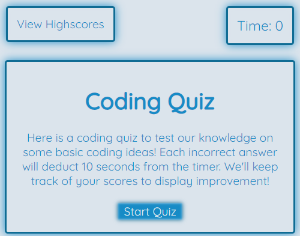
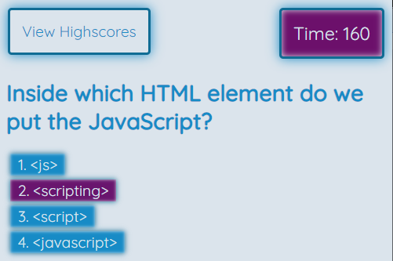
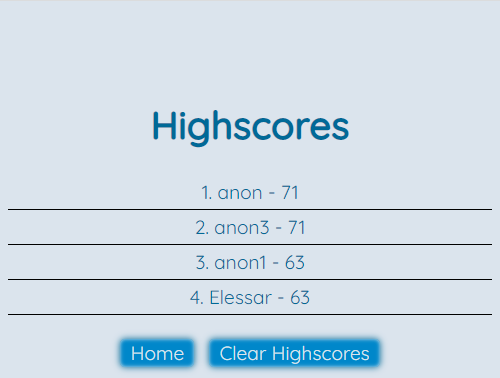

# Project: Module 4 Challenge: JavaScript Code Quiz

  Deployable Link: https://tunestring.github.io/m4challenge/

## Table of Contents: 
- [Module 4 Challenge: JavaScript Code Quiz](#project-web-apis-code-quiz)
  - [Table of Contents:](#table-of-contents)
  - [License:](#license)
  - [Description:](#description)
  - [Installation Instructions:](#installation-instructions)
  - [Thank You:](#thank-you)  
  - [Github:](#github)
  - [Images:](#images)
 

## License:
See Repo for more information

## Description:
A demonstration of combined skills of HTML, CSS, and JavaScript to deploy an application creating a quiz based off of JavaScript knowledge.

## Installation Instructions: 
Launch the site in the browser of your choosing.

## Thank You
Thank you to everyone involved in my daily learning to push me to continue to grow and develop. A special thank you to my classmates, my teacher and TA, and most of all, my wife.

## Github: 
Check out my struggle and progress in my journey: https://github.com/Tunestring

## Images:

